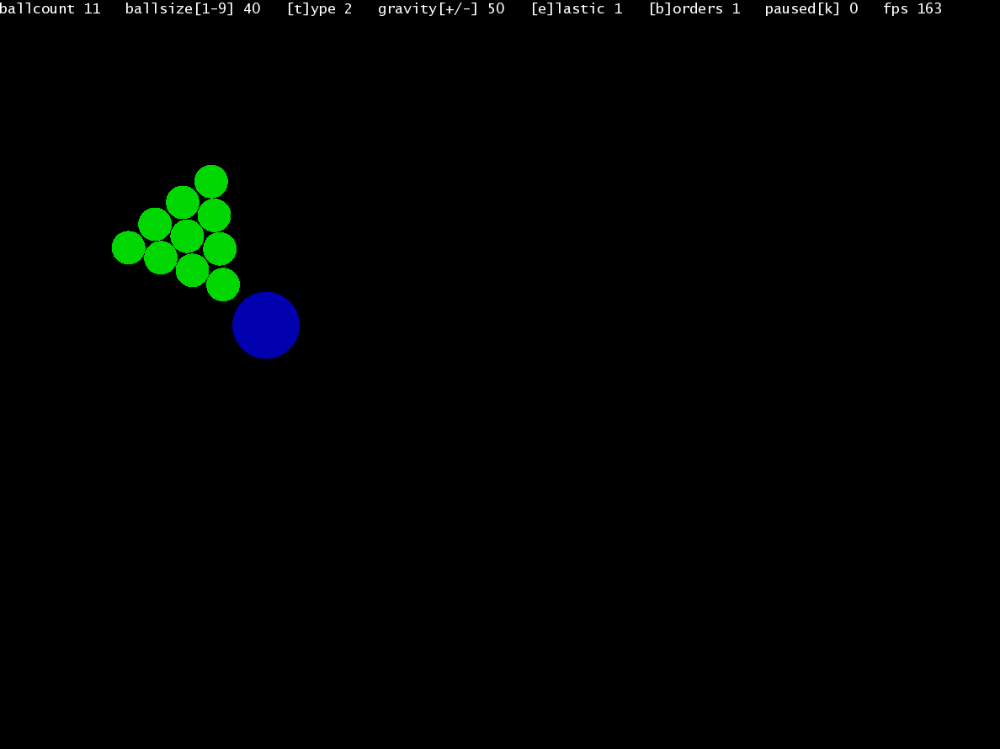

# Dynamic particle simulator

A simple dynamic simulation toy program. You can create balls of different
sizes, and colors. Balls are affected by gravity, and can collide with each
other. This makes it possible to create diverse simulations.

## How to build

This project is dynamically linked to SFML. You can download the library here:
https://www.sfml-dev.org/download/sfml/2.6.1/ **SFML requires specific compiler
versions**, that can be downloaded from the same url.

1. Set the compiler, include, and lib paths in the Makefile.
2. run make

## Usage

- Use the Mouse to add a new ball. You can move the cursor before releasing, to
change the initial speed.

- To delete a ball, you can right-click on it. This is easiest, if the
simulation is paused.
    - Additionally, you can delete the last added ball, with the BACKSPACE key.

- Use the 1-9 keys to specify ball size. The mass of the balls scales
according to their size.

- Use the T key to chagne ball type. There are 4 kinds. Balls with different types
repel each other, and the same types pull each other together. Ball types are
indicated with different colors.

- Use the +- keys to change gravity. Gravity can be negative in this simulation.

- Use the E key to toggle collision elasticity.

- Use the B key to toggle borders.

- Use the K key to pause/resume.
    - In the paused state, use L to jump one simulation frame.

- The UP/DOWN keys can be used to speed up/slow down all of the balls.
    - With the SPACE key, you can make all balls stop. This is different from a pause,
    in that this will not stop the simulation, but only make all velocities 0.

## Examples

### Billiard balls bouncing

Billiard balls bounce around elastically.

  
  
  

### Moons orbiting

Multiple moons orbit a single planet with large mass.

  
  
  
  

### Magnetic particles

Particles with different charges attract and repel each other.

  

